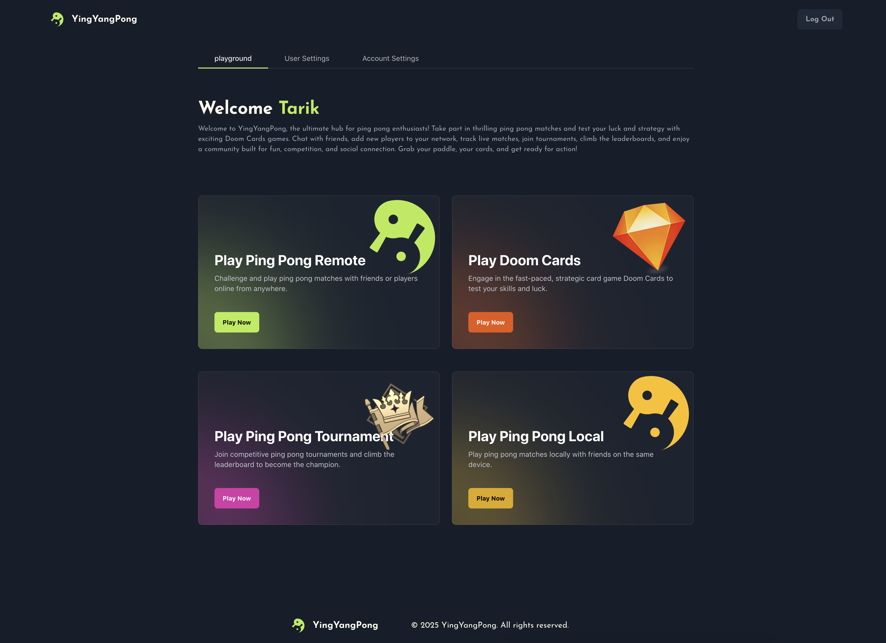
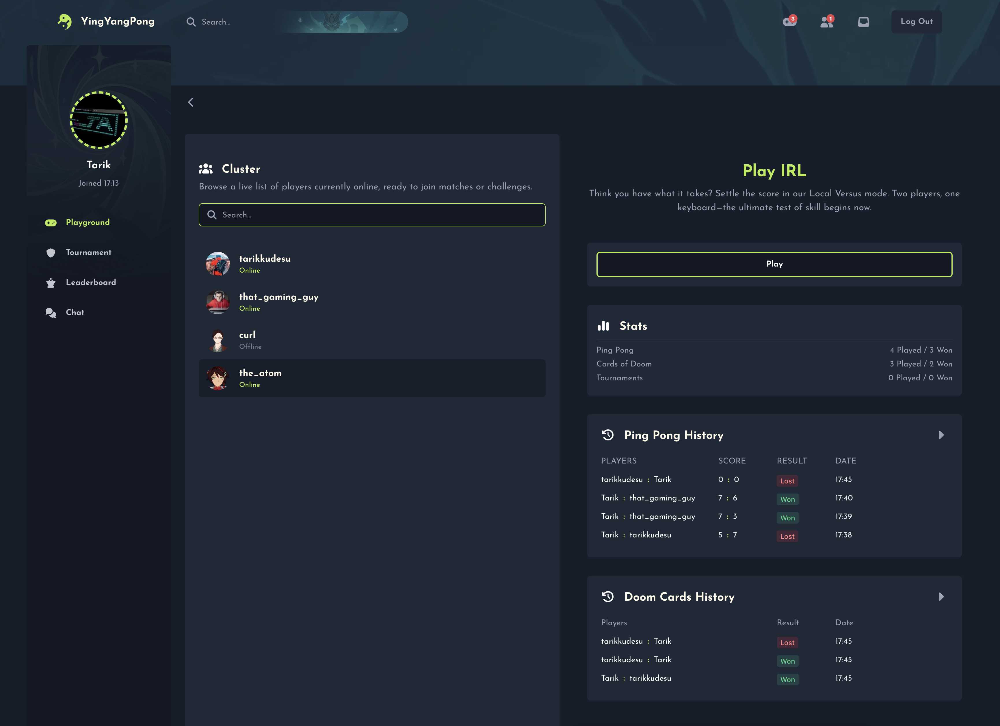
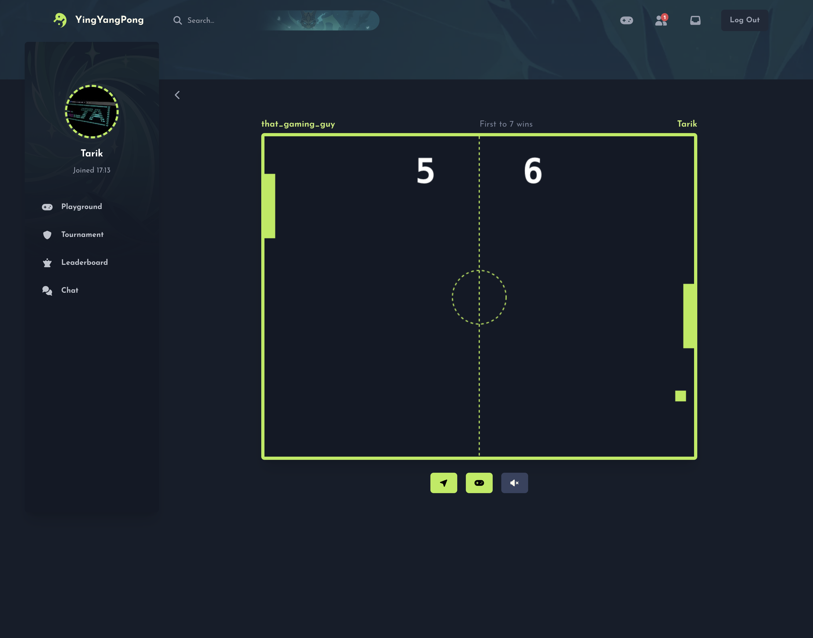
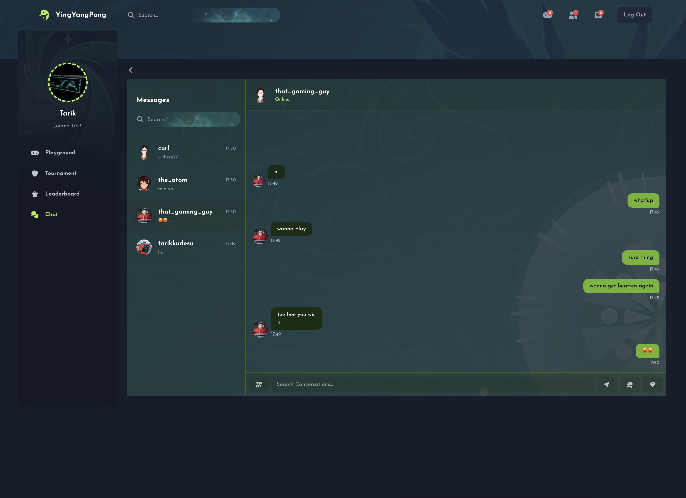
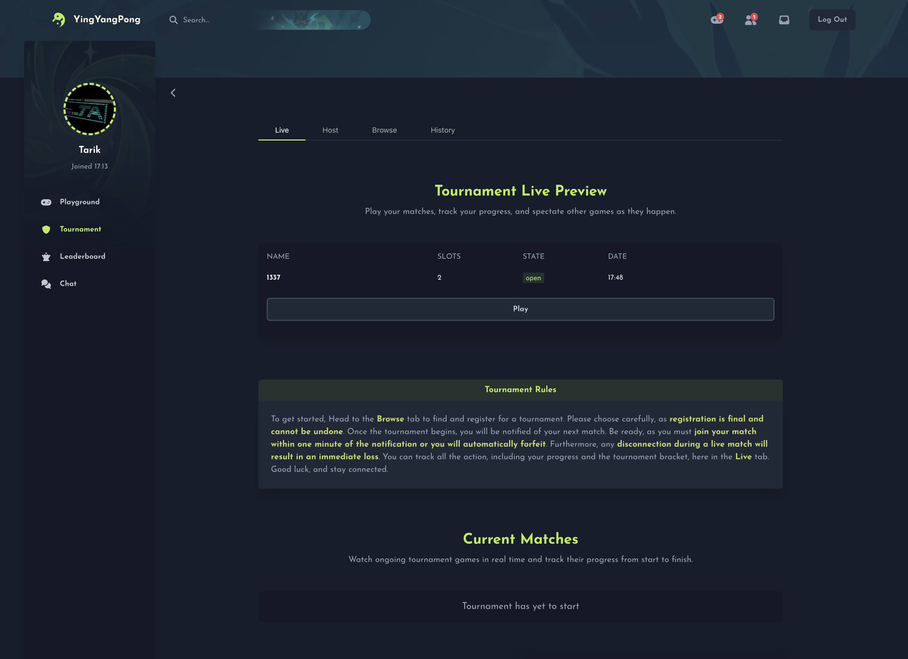

# transcendence

## **Project UI**

### Home

### Playground

### Game

### Chat

### Tournament

## **Minimal technical requirement + 25%**

- The frontend should be developed using `Typescript` as base code
- Your website must be a SPA, The user should be able to use the Back and Forward buttons of the browser.
- Your website must be compatible with the **latest stable up-to-date version** of `Mozilla Firefox`.
- The user should encounter no unhandled errors or warnings when browsing the website.
- You must use Docker to run your website. Everything must be launched with a single command line to run an autonomous container.
- Any password stored in your database must be **hashed**.
- Protection against SQL injections/XSS attacks.
- You must use secure Protocoles (HTTPS/WSS).
- Server side form validation.
- You must be able to play a live Ping Pong game.
- Implement a Tournament system.

## Modules + 75%

- **Major module**: Use a framework to build the backend.
- **Minor module**: Use a database for the backend.
- **Major module**: Standard user management, authentication, users across tournaments.
- **Major module**: Designing the backend as microservices.
- **Major module**: Implement Two-Factor Authentication (2FA) and JWT.
- **Major module**: Implementing a remote authentication.
- **Minor module**: Support on all devices.
- **Major module**: Live chat.

## Bonus + 25%

- **Major module**: Remote players
- **Major module**: Add another game with user history and matchmaking.
- **Minor module**: Monitoring system.

## Available Modules

- **Web**
    - **Major module**: Use a framework to build the backend. ✅
    - **Minor module**: Use a framework or a toolkit to build the frontend.
    - **Minor module**: Use a database for the backend. ✅
    - **Major module**: Store the score of a tournament in the Blockchain.
- **User Management**
    - **Major module**: Standard user management, authentication, users across tournaments. ✅
    - **Major module**: Implementing a remote authentication. ✅
- **Gameplay and user experience**
    - **Major module**: Remote players ✅
    - **Major module**: Multiplayer (more than 2 players in the same game).
    - **Major module**: Add another game with user history and matchmaking. ✅
    - **Minor module**: Game customization options. ✅
    - **Major module**: Live chat. ✅
- **AI-Algo**
    - **Major module**: Introduce an AI opponent.
    - **Minor module**: User and game stats dashboards
- **Cybersecurity**
    - **Major module**: Implement WAF/ModSecurity with a hardened configura-tion and HashiCorp Vault for secrets management.
    - **Minor module**: GDPR compliance options with user anonymization, local data management, and Account Deletion.
    - **Major module**: Implement Two-Factor Authentication (2FA) and JWT. ✅
- **Devops**
    - **Major module**: Infrastructure setup for log management.
    - **Minor module**: Monitoring system. ✅
    - **Major module**: Designing the backend as microservices. ✅
- **Graphics**
    - **Major module**: Use advanced 3D techniques.
- **Accessibility**
    - **Minor module**: Support on all devices. ✅
    - **Minor module**: Expanding browser compatibility.
    - **Minor module**: Supports multiple languages.
    - **Minor module**: Add accessibility features for visually impaired users.
    - **Minor module**: Server-Side Rendering (SSR) integration.
- **Server-Side Pong**
    - **Major module**: Replace basic Pong with server-side Pong and implement an API.
    - **Major module**: Enabling Pong gameplay via CLI against web users with API integration.
